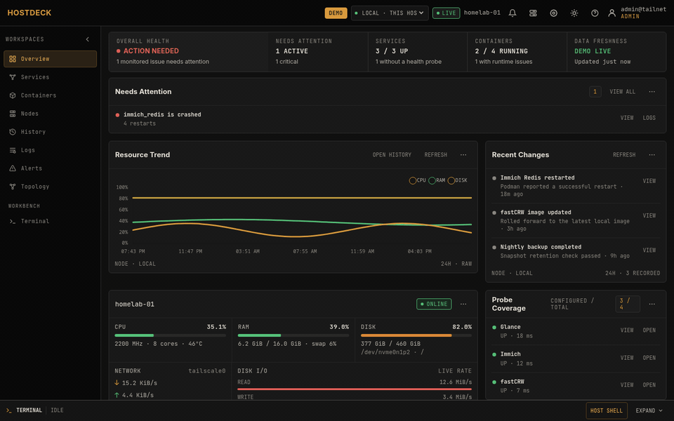
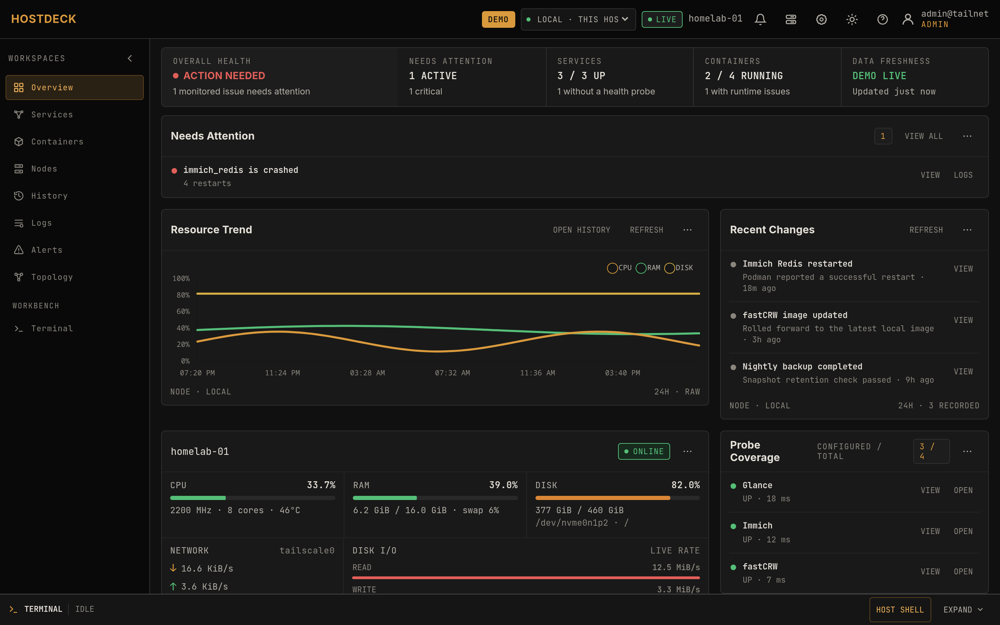
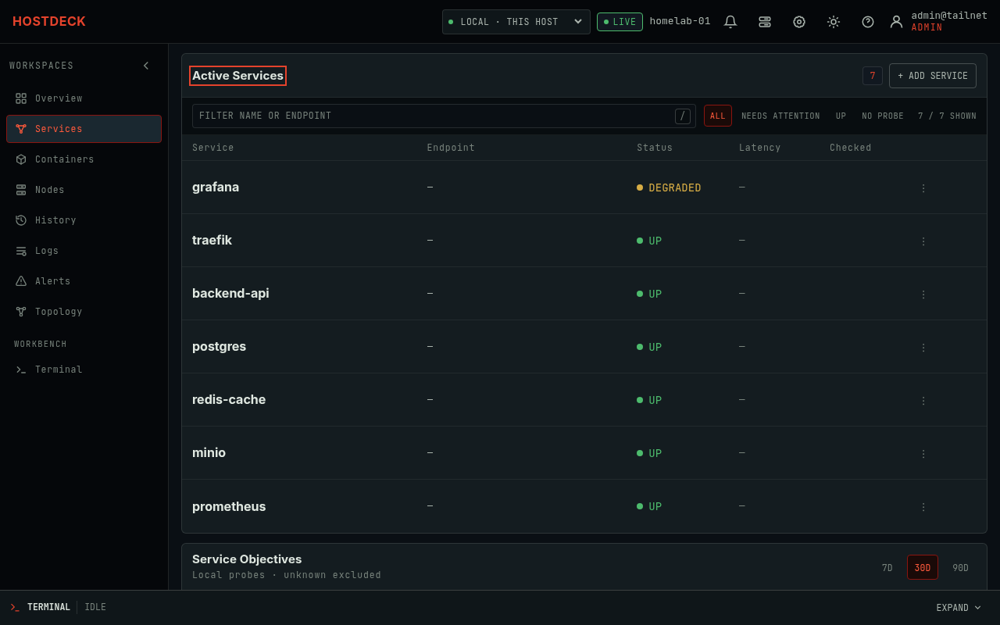
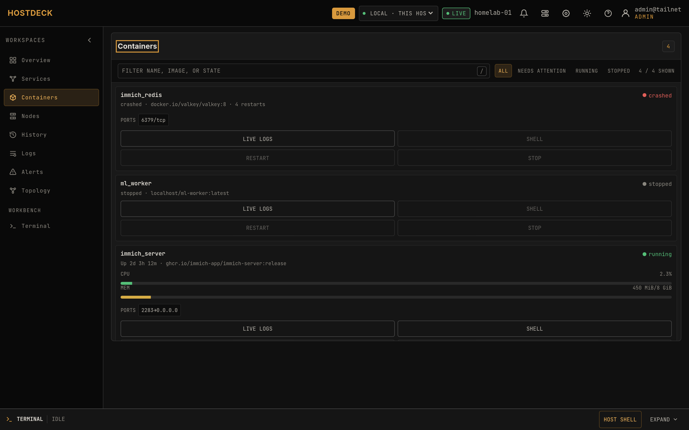
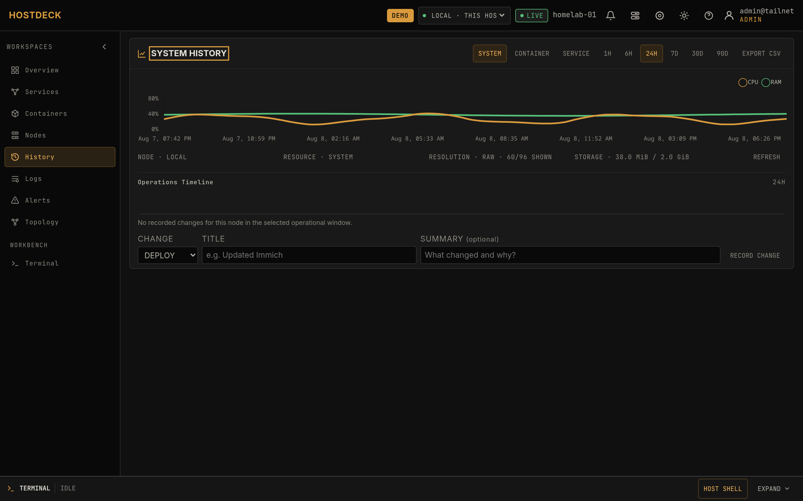
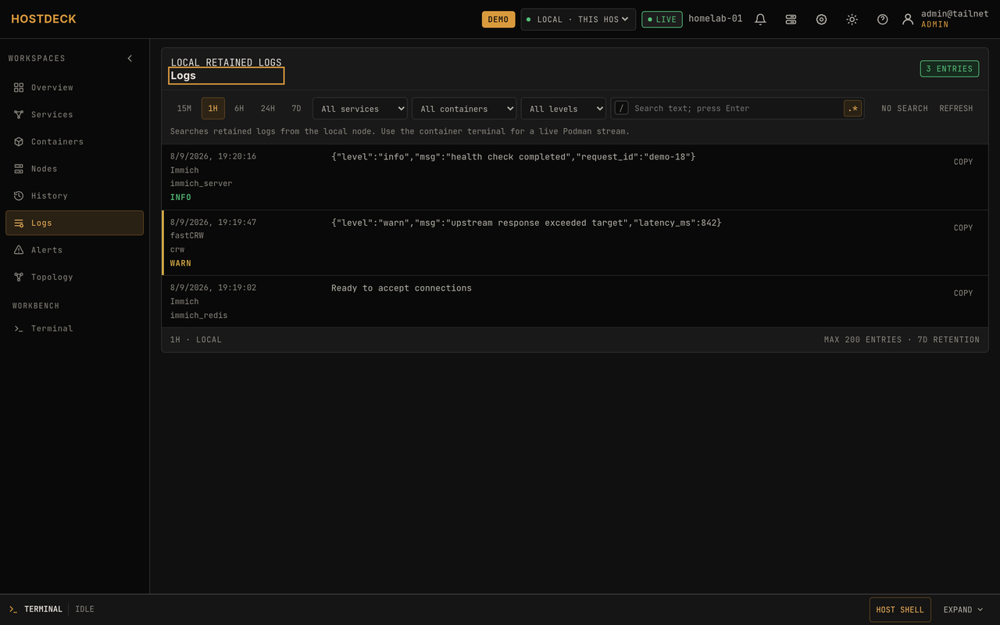
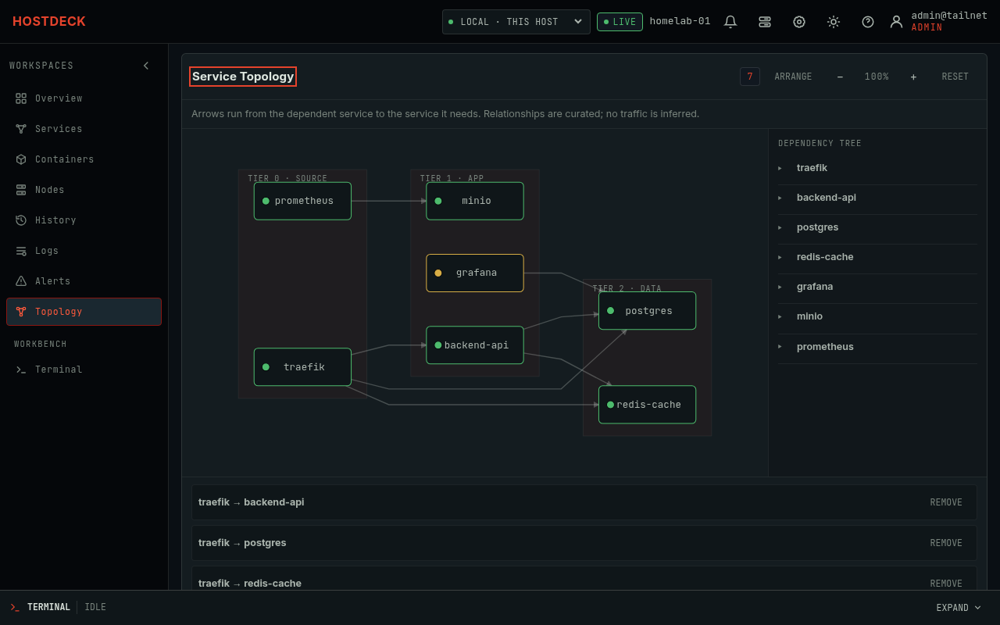
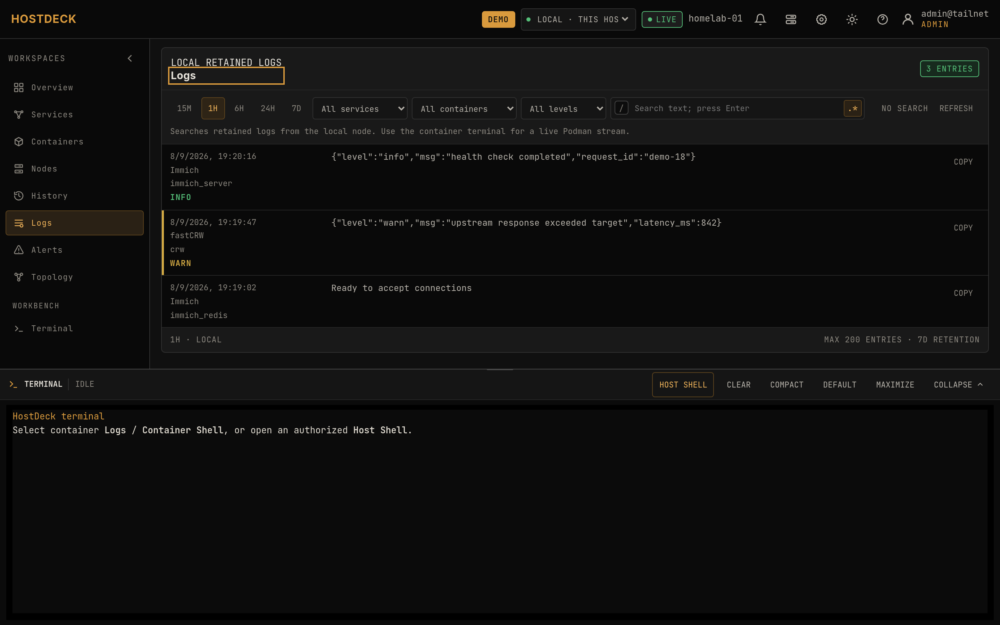
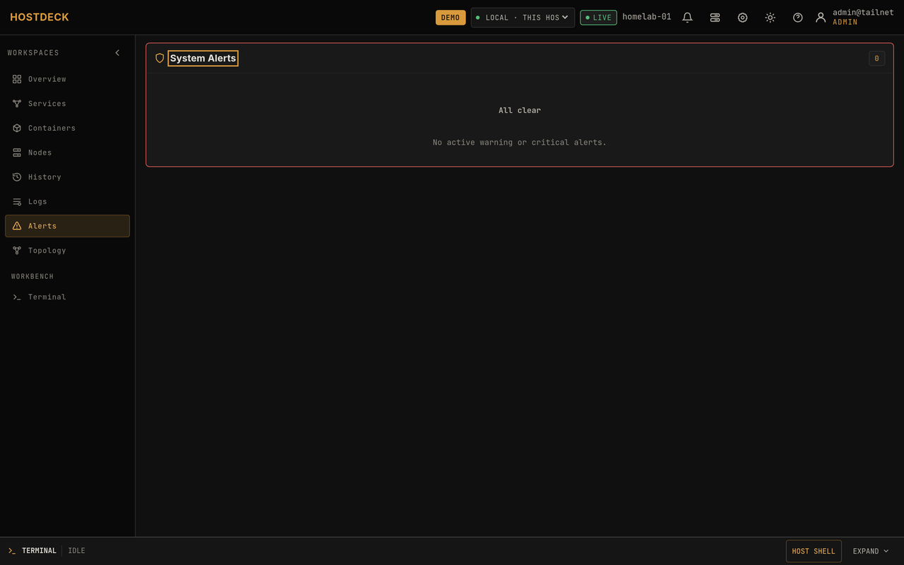
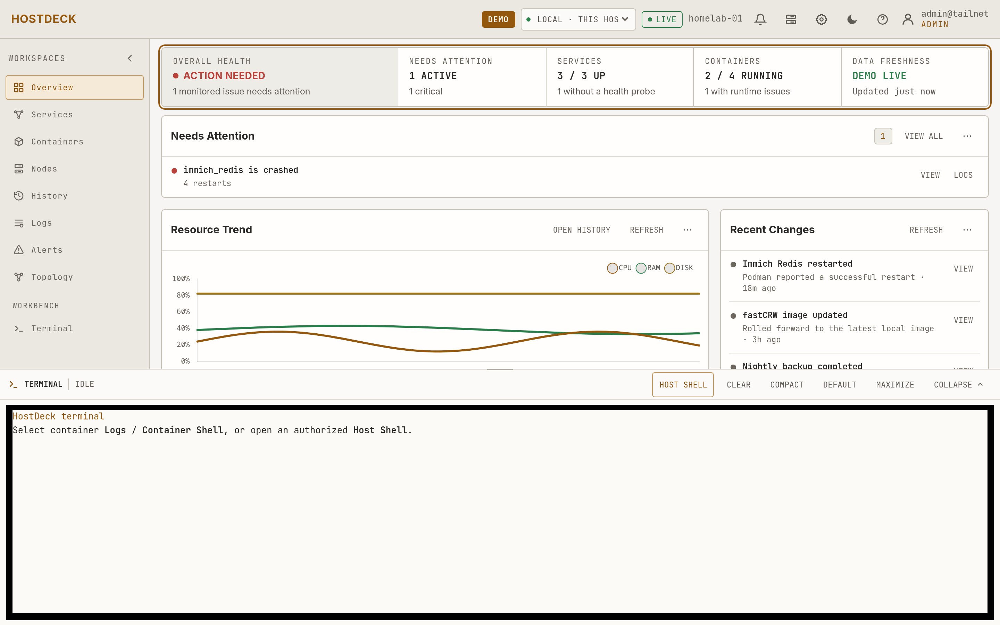

<h1 align="center">HostDeck</h1>

<p align="center"><strong>A Tailscale-only operations console for 1–5 rootless Podman homelab nodes: observe services and backup freshness, then open the correct container or host shell — no inbound ports, no monitoring stack.</strong></p>

<p align="center"><code>Go</code> · <code>SQLite</code> · <code>Podman</code> · <code>Tailscale</code> · <code>WebSocket</code> · <code>Vanilla JS</code></p>

<p align="center">
  <a href="https://github.com/bnhminh1010/hostdeck/blob/main/LICENSE"></a>
  <a href="https://github.com/bnhminh1010/hostdeck/releases"></a>
  <a href="https://github.com/bnhminh1010/hostdeck/actions"></a>
  <a href="https://github.com/bnhminh1010/hostdeck"></a>
</p>

<p align="center"><sub>Three static Go binaries. No Node.js. No npm. No CDN runtime dependencies.</sub></p>

<p align="center">
  <a href="#quick-start-with-podman-compose">Quick start</a> · <a href="#packages">Packages</a> · <a href="#architecture-and-data-lifecycle">Architecture</a> · <a href="#security-boundary">Security</a> · <a href="#development-and-verification">Development</a> · <a href="docs/operations.md">Operations</a> · <a href="docs/adr.md">ADR</a> · <a href="docs/comparison.md">Comparison</a> · <a href="docs/migration.md">Migration</a> · <a href="docs/benchmarks.md">Benchmarks</a>
</p>

<p align="center"><a href="https://hostdeck.thinkai.id.vn/app/?demo=1">Open the public demo</a> · <a href="https://github.com/bnhminh1010/hostdeck/releases">Download a release</a></p>

<p align="center"></p>

> [!NOTE]
> This is an intentionally small operations console for 1–5 nodes—not a
> replacement for Grafana, Prometheus, Loki, or an enterprise control plane.
> It favors direct visibility and safe everyday action on a personal homelab.

| Observe | Act | Retain | Trust |
|---|---|---|---|
| Host, services, containers, TLS, backups and up to five nodes | Logs, container shells and explicitly confirmed host Bash | Tiered metrics, SLOs, alerts and operational events for up to 90 days | Tailscale identity, viewer/admin roles, CSRF and same-origin mutation guards |

## Screenshots



| Services with SLO error budgets | Container inventory with logs & shells |
|---|---|
|  |  |

| 90-day history and operations timeline | Regex log search with result navigation |
|---|---|
|  |  |

| Service dependency topology | Host shell inside the console |
|---|---|
|  |  |

| Alert center with ack/silence | Light theme |
|---|---|
|  |  |

## Why this is different

Not a bookmark grid, not a Grafana stack, not a generic "works with Tailscale"
project. It focuses on one loop homelab operators actually run: *see a problem,
understand it, act on it safely.*

| Compared to | This dashboard |
|---|---|
| Start pages (Homepage, Homarr, Dashy) | Real host/container/service state, not link tiles |
| Monitors (Beszel, Netdata, Uptime Kuma) | First-party SLOs, backup freshness, and a shell to act on findings |
| Admin consoles (Cockpit, Portainer) | 1–5 nodes, rootless Podman-first, no inbound agent port |
| Browser terminals (ttyd, WeTTY) | Identity-aware, context-linked terminal inside the ops console |

Key differentiators, each implemented in code (see `internal/`):

- **No inbound agent port.** Local host access runs through a Unix-socket host
  agent; remote nodes dial out over Tailscale HTTPS/WSS. No SSH, agent listener,
  or reverse proxy to secure on any node.
- **Tailscale identity is the auth plane.** Viewer/admin roles come from Tailnet
  identity, sessions and mutations are CSRF/`SameSite` guarded, and identity
  headers are trusted only from loopback. Everything runs on `tailscaled`
  client features (Serve identity headers, SOCKS5), so the mesh works with the
  hosted Tailscale control plane **or a self-hosted Headscale** — no dependency
  on Tailscale's cloud.
- **Operate, not just observe.** Container shells and an explicitly confirmed
  host Bash login are context-linked to the alert, log or metric that sent you
  there.
- **Bounded operational memory.** Tiered 1h–90d SQLite history with a visible
  quota and an archived-resource picker — no Prometheus required.
- **Backup freshness and SLO error budgets** without owning backup credentials
  or running a metrics stack.

## Capabilities

- **See the state of the lab.** Live CPU, memory, disk, network, load, uptime,
  temperature and process metrics; rootless Podman health and resource usage;
  tiered SQLite history for host, container and service uptime across
  1 hour–90 days; local and remote fleet capacity; HTTPS certificate
  observations; backup freshness; curated service dependencies; a 90-day change
  timeline; and per-service availability objectives with 7/30/90-day windows
  and explicit error budgets.
- **Respond without leaving the dashboard.** Persistent service shortcuts with
  SSRF-safe HTTP/HTTPS or TCP probes; read-only container logs with
  follow/pause/search (including regex) and download; admin-only interactive
  container shells in xterm.js; an explicitly confirmed host Bash login;
  stateful alert rules for nodes, hosts, services, containers and backup
  freshness with acknowledge/silence (1/6/24 h); and optional ntfy plus generic
  HMAC-signed webhook delivery.
- **Keep configuration and access deliberate.** One local node plus up to four
  remote Linux/Podman nodes connected outbound over Tailscale HTTPS/WSS;
  versioned, secret-free export/import with merge/replace previews and an
  `If-Match` revision guard; viewer/admin authorization from Tailscale identity
  with same-origin and CSRF checks and bounded audit history.

There is **no Node.js toolchain**: no npm, package manifest, bundler, CDN or
runtime download. xterm.js, FitAddon and Chart.js are versioned browser bundles
under `static/lib/` and embedded with `go:embed`. The repository `.gitattributes`
marks that directory as `linguist-vendored`, so GitHub language statistics do
not mistake the local browser dependencies for application JavaScript.

## Architecture and data lifecycle

```text
Tailnet browser
      │ HTTPS / WSS (Tailscale Serve)
      ▼
┌───────────────────────────────────────────────────────┐
│ Dashboard container                                   │
│ Go API + WebSocket + embedded static UI + SQLite       │
└───────┬─────────────────────┬─────────────────────┬───┘
        │                     │                     │
        ▼                     ▼                     ▼
  Podman socket         Host-agent PTY       Tailscale WSS
  containers/logs       local Bash           remote node agents
                                                    │
                                                    ▼
                                            Podman + host metrics
```

The dashboard has no published host port. Tailscale Serve terminates the
tailnet HTTPS/WSS connection, while the Go process listens only on loopback in
the shared network namespace. Remote agents always dial out to the dashboard.
The dashboard collects the local node every 2 seconds; host samples every
10 seconds, container samples every 30 seconds and service observations every
minute; remote node agents send snapshots and heartbeats every 10 seconds.

History is rolled up and retained in tiers:

| Data | Raw | Intermediate | Long-term |
|---|---:|---:|---:|
| Host | 10 s for 48 h | 1 min for 30 d | 15 min for 90 d |
| Container | 30 s for 48 h | 5 min for 30 d | 1 h for 90 d |
| Service uptime | transitions | hourly uptime buckets | 90 d |

`HISTORY_QUOTA_BYTES` defaults to 2 GiB (64 MiB–16 GiB). At 80% the UI reports
a warning; at 100% new raw history pauses while live metrics, alert evaluation
and service transition recording continue. The history resource picker combines
live inventory with retained instances, so a resource can still be selected
after it disappears from the current snapshot.

The latest TLS certificate observation is refreshed at startup and every
12 hours for each configured HTTPS service, sharing the service-probe CIDR
allowlist. Metrics frames that exceed their transport budget identify the
omitted sources explicitly — the UI displays a visible **PARTIAL** chip and
degrades the overview instead of treating an incomplete inventory as healthy.

The SQLite database and Tailscale node state live in named volumes and survive
a Compose recreate. History is local to this dashboard instance; it is not a
Prometheus-compatible long-term archive. Embedded assets use content ETags:
stable vendor URLs under `/lib/` get a one-day cache with `must-revalidate`,
application assets a one-hour revalidation window.

## Quick start with Podman Compose

Prerequisites: Linux with systemd and `/bin/bash`, rootless Podman, a Compose
provider, and a tailnet with MagicDNS and HTTPS certificates enabled. Run the
installer as the unprivileged Podman account (never as root):

```bash
curl -fsSL https://github.com/bnhminh1010/hostdeck/releases/latest/download/install.sh | bash
```

The installer preserves an existing `.env`, enables the rootless Podman socket,
installs the host agent and starts Compose. It prompts for `TS_AUTHKEY` and
`ADMIN_USERS` when not already exported; for automation, pin an exact release:

```bash
TS_AUTHKEY=tskey-auth-... \
ADMIN_USERS=alice@example.com \
  bash install.sh --version vX.Y.Z --non-interactive
```

Use `--dry-run` to validate the host without changing it. The installer
supports APT, DNF and Pacman hosts. For manual clone setup, per-service
configuration (`.env`, host Bash, ntfy/webhook delivery, Loki + Vector logging
overlay, backup reports, remote nodes, export/import, upgrades) and
troubleshooting, see [docs/operations.md](docs/operations.md).

Open `https://homelab-dashboard.<your-tailnet>.ts.net` from a device in the
same tailnet. Compose deliberately exposes no host port; access it through
Tailscale Serve.

## Packages

<p>
  <a href="https://github.com/bnhminh1010/hostdeck/releases/latest"></a>
  <a href="https://github.com/bnhminh1010/hostdeck/blob/main/LICENSE"></a>
  <a href="https://ghcr.io/bnhminh1010/homelab-dashboard"></a>
  <a href="https://hub.docker.com/r/minhtuyetvoi/homelab-dashboard"></a>
</p>

| Registry | Image | Architectures | Tag policy | Production use |
|---|---|---|---|---|
| [GitHub Container Registry](https://ghcr.io/bnhminh1010/homelab-dashboard) | `ghcr.io/bnhminh1010/homelab-dashboard` | `linux/amd64`, `linux/arm64` | Exact semver and `sha-<commit>`; stable v1+ also publish `v<major>.<minor>`, `v<major>`, `latest` | `DASHBOARD_IMAGE=ghcr.io/bnhminh1010/homelab-dashboard:vX.Y.Z` |
| [Docker Hub](https://hub.docker.com/r/minhtuyetvoi/homelab-dashboard) | `docker.io/minhtuyetvoi/homelab-dashboard` | `linux/amd64`, `linux/arm64` | Mirrors GHCR | `DASHBOARD_IMAGE=docker.io/minhtuyetvoi/homelab-dashboard:vX.Y.Z` |

Use an exact release tag in production. Beta and pre-v1 tags publish only their
exact version plus a commit-SHA tag; never deploy `latest`. From the first
container-enabled release onward, each `v*` tag publishes the same
multi-architecture dashboard image to GHCR and Docker Hub, with provenance and
an SBOM.

## Security boundary

### Access at a glance

| Actor | Allowed actions |
|---|---|
| **Viewer** | Read metrics, history, alerts and container logs. |
| **Admin** | Mutate services/rules/configuration, acknowledge or silence incidents, manage nodes, open container shells and test ntfy. |
| **Host shell user** | An admin explicitly listed in `HOST_SHELL_USERS`, after an in-UI confirmation. The login shell has the Unix account's normal power. |

Every authenticated Tailnet user can view metrics and container logs. Only
exact login names in `ADMIN_USERS` can mutate configuration, acknowledge or
silence alerts, create/revoke nodes, open Container Shell, test ntfy or import
configuration. Host Bash also requires the explicit host-shell allowlist and a
visible confirmation.

Production trusts Tailscale identity headers only when the dashboard listens
on loopback and the request's immediate peer is loopback. The Compose topology
keeps the dashboard in the Tailscale container's network namespace and does not
publish it directly. Do not expose the binary on `0.0.0.0` while trusting
identity headers.

The mounted rootless Podman socket is as powerful as its Unix owner. The
dashboard therefore hides its protected containers, accepts typed log/exec
operations rather than arbitrary commands, and runs with a read-only
filesystem, dropped capabilities and `no-new-privileges`.

The local host agent and every remote node agent run as the account that
installed their systemd user service, never as root. **Host Shell intentionally
has that account's normal filesystem, network, rootless Podman and optional
`sudo` access.** The remote unit does not use `ProtectSystem`, `PrivateTmp` or
`NoNewPrivileges`, because those controls would make the advertised host login
shell restricted or read-only. A disconnect terminates active streams; host
shells are never resumed automatically.

To immediately disable local host access, set `HOST_SHELL_ENABLED=false`,
recreate the dashboard and optionally stop the local agent:

```bash
systemctl --user disable --now homelab-host-agent.service
```

To remove a remote shell path, revoke that node in Settings and stop or
uninstall its node agent.

## Development and verification

The project uses Go tooling only:

```bash
go mod verify
go vet ./...
go test ./... -count=1
go test -race ./... -count=1
go test -tags=integration ./internal/httpapi -count=1
go test -tags=browser ./tests/browser -count=1
```

For a frontend-only smoke test, serve the embedded UI assets and open the
explicit demo route:

```bash
python3 -m http.server 8080 --directory static
# open http://127.0.0.1:8080/?demo=1
```

This mode exercises the UI with deterministic demo data (see
[docs/operations.md](docs/operations.md#static-ui-demo-and-widget-customization)
for caveats). Browser tests use chromedp and a locally installed
Chromium/Chrome; unit tests use fake Podman/agent Unix sockets and never touch
the real host socket. The GitHub release workflow performs the Go, browser,
CodeQL, vulnerability, multi-architecture image and Compose checks before it
pushes to either registry.

## Contributing and security

Contributions follow [CONTRIBUTING.md](CONTRIBUTING.md). Please report
security issues privately through the process in [SECURITY.md](SECURITY.md),
not in a public issue. This project is licensed under
[Apache-2.0](LICENSE).
